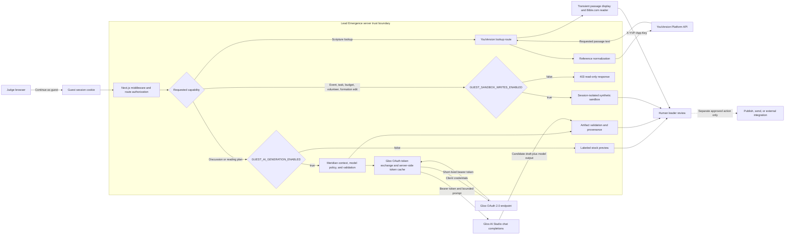

# Competition Runtime Architecture

This diagram shows the judge-facing Scripture flow and the two independent guest controls. It is intentionally scoped to implemented behavior rather than the full future platform vision.

## Boundary Notes

| Boundary | What crosses it | What does not cross it |
| --- | --- | --- |
| Browser to Lead Emergence | User-entered reference, question, or planning edit; guest session cookie | YouVersion app key, Gloo client secret, Gloo bearer token, Supabase service-role key |
| Lead Emergence to YouVersion | Normalized passage ID, Bible ID, response-format options, app-key header | Meridian organizational memory, ministry records, student reflections |
| Lead Emergence to Gloo | Bounded task instructions, Scripture reference, approved context, safety/model policy | Direct database access, provider credentials for other systems, authority to publish or act |
| Guest write gate to sandbox | Allowlisted demo mutations scoped by guest session ID | Canonical production ministry tables and live integration routes |
| AI result to leader review | Provider/model provenance, candidate draft, safety metadata, limitations | A pastoral verdict, diagnosis, approval, send, or external system write |

## Implemented Components

- Guest session creation: `app/api/auth/guest/route.ts`
- Request gate: `middleware.ts`
- Runtime flags: `lib/competition/guest-runtime.ts`
- YouVersion route and adapter: `app/api/student/scripture/lookup/route.ts`, `lib/scripture/youversion.ts`
- Gloo adapter and OAuth cache: `lib/scripture/gloo.ts`
- Meridian orchestration and validation: `lib/scripture/meridian-ai.ts`, `lib/scripture/meridian-synthesis.ts`
- Guest operations sandbox: `lib/guest/sandbox-store.ts`
- Guest formation sandbox: `lib/scripture/student-local-state.ts`
- Guest volunteer sandbox: `lib/guest/volunteer-hub-adapter.ts`
- Leader-review workflow: `lib/scripture/discussion-workflow.ts`

## Persistence Semantics

`GUEST_SANDBOX_WRITES_ENABLED=true` means “allow isolated demo edits,” not “write public data to production.” Event, task, budget, volunteer, and selected formation changes are keyed to the guest session and may reset with the session, server runtime, or deployment.

The canonical judge seed remains code-reviewed synthetic data in `lib/guest/lead-emergence-demo-context.ts`. Permanent changes to the default judge experience require editing that seed, running validation, and deploying the reviewed commit.

## External Side-Effect Boundary

The diagram’s dotted final edge is not an AI capability. Publishing, sending, and live integration writes require separate routes, credentials, authorization, and an explicit human-controlled action. Guest middleware continues to block live integration prefixes, live Google Drive refresh, and event-admin AI even when both competition flags are enabled.
