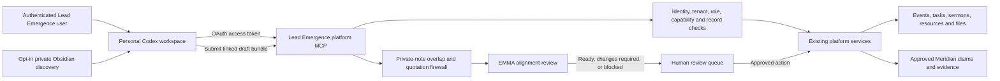

# Personal AI Platform MCP Roadmap

## Product decision

Lead Emergence will evolve its existing Meridian MCP into a permission-aware platform connection for personal AI clients such as Codex. A user should be able to create in their own AI workspace, use explicitly selected private Obsidian material for personal discovery, ground shared resources in approved Meridian knowledge, save the resulting materials into the correct Lead Emergence workspace, and receive an EMMA alignment review before human approval.

This direction does not make a personal AI client a trusted database client, give it organization-wide access, or allow EMMA to define ministry theology. Lead Emergence remains the system of record and enforces identity, permissions, provenance, review, and execution boundaries on the server.

## Intended experience

A leader should eventually be able to ask Codex:

> Use the Fall Retreat sermon I am writing to create a leader guide, discussion questions, and a slide plan, then place the drafts in the Fall Retreat workspace.

The connected system should:

1. authenticate the leader through Lead Emergence;
2. locate only events, sermons, files, tasks, and resources that leader may access;
3. allow the leader's personal Codex session to use explicitly selected Obsidian notes as private creative context;
4. retrieve approved Meridian claims and permitted source material for organizational grounding;
5. create a linked resource bundle containing the requested drafts;
6. attach the bundle to the correct event, series, sermon, ministry, and audience;
7. run the bundle through EMMA's alignment and safety review;
8. return the saved draft links and review findings; and
9. require a person to approve any publication, external communication, or other consequential action.

## System responsibilities

| Component | Responsibility | Must not do |
|---|---|---|
| Personal AI client, initially Codex | Creative reasoning, drafting, transformation, and user-directed orchestration using the user's own AI account | Receive raw database access, bypass Lead Emergence permissions, or silently publish |
| Obsidian connection | User-owned, opt-in discovery over selected folders or frontmatter | Become approved organizational theology merely because a note exists or is polished |
| Meridian | Provide approved theology, culture, policy, teaching history, curriculum, and source provenance | Recreate a leader's artistic style, treat sermons as permanent doctrine, or promote AI output automatically |
| Platform MCP | Authenticate the user and expose narrow, typed platform actions through existing service and permission boundaries | Expose general SQL, service-role credentials, unrestricted file access, or broad CRUD primitives |
| EMMA | Perform the final automated ministry-alignment, safety, privacy, and grounding review | Set doctrine, infer motives or diagnoses, silently rewrite the author's voice, self-approve, publish, or send |
| Lead Emergence application | Store linked records, drafts, review state, provenance, permissions, revision history, and audit events | Treat an AI-generated artifact as approved merely because it was saved |
| Human reviewer | Make the final judgment on ministry alignment and consequential use | Delegate final accountability to the model |

## Target flow

## Authentication and authorization

The MCP must act as the authenticated Lead Emergence user, not as an organization-wide bot.

- OAuth establishes the user's Lead Emergence identity; it does not grant platform data access by itself.
- The server derives `user_id` and `ministry_id` from the token and profile. Tool arguments never choose the tenant.
- Each tool requires an explicit, revocable capability grant in addition to the user's platform role.
- Existing record-level rules and Supabase RLS remain independently enforceable.
- Tools call typed application services or repositories. They never expose SQL or service-role access.
- Reads, draft creation, record updates, destructive actions, and external communication are separate permissions.
- Token revocation, role changes, and capability changes must take effect without reconnecting the entire organization.
- Every operation records the user, client, tool, affected records, idempotency key, result, and timestamp.

## Proposed tool surface

These names describe roadmap contracts, not tools that are already live. Each tool must return stable record identifiers and links the client can use in later calls.

### Existing Meridian tools

- `search`
- `fetch`
- `submit_resource_draft`

### Platform discovery

- `list_events`
- `get_event`
- `list_tasks`
- `get_sermon_workspace`
- `list_resource_bundles`
- `get_resource_bundle`

### Controlled platform work

- `create_event_draft`
- `update_event`
- `create_task`
- `update_task`
- `create_resource_bundle`
- `update_resource_draft`
- `attach_resource_to_workspace`
- `submit_bundle_for_emma_review`

The initial operational release should not expose delete, publish, send, bulk-update, medical, pastoral-care, or unrestricted people-record tools. Updates to significant event facts should return a preview and require explicit confirmation. Generated resources always begin as drafts.

## Linked resource bundles

`create_resource_bundle` is the core sermon-development workflow. One user request may create several coordinated artifacts while preserving their individual identity and review status.

A bundle may contain:

- sermon draft or sermon-support notes;
- leader guide;
- discussion or small-group questions;
- slide plan;
- activities;
- devotional or reading-plan draft; and
- supporting attachments.

Every artifact should retain links to:

- ministry and tenant;
- creator and connected AI client;
- event, teaching series, sermon, audience, and task when applicable;
- source artifact and sibling artifacts in the bundle;
- approved Meridian claim and fragment identifiers;
- private-discovery provenance without storing unnecessary raw Obsidian text;
- provider/model trace supplied by the client when available;
- EMMA review version, findings, and outcome;
- human decisions and revision history; and
- the final approved or rejected state.

## Obsidian boundary

Obsidian remains private, unreviewed, authority-none, never-quote, discovery-only material by default.

- A personal Codex session may use only folders, files, or frontmatter scopes the user explicitly selects.
- Raw note text stays in the user's private creative workspace and does not enter Lead Emergence's normal final-answer generator.
- The Lead Emergence MCP does not provide volunteers or other users access to another person's Obsidian material.
- Person-specific, pastoral, medical, safeguarding, and similarly sensitive notes stay outside general discovery and resource generation.
- A draft influenced by private discovery is checked for exact and fuzzy overlap before it can enter the shared review queue. Unsafe overlap fails closed or requires a designated reviewer.
- Quoting, paraphrasing, citation, final-answer use, external communication, and organizational reuse remain separate permissions.
- Reusable material enters Meridian only through explicit claim-by-claim promotion. Folder location, polish, or prior AI use never implies approval.

An opt-in approved folder or frontmatter convention may simplify future review, but it may nominate only candidates; it must never bypass promotion.

## EMMA final review contract

EMMA is the final automated check before human review, not the final authority. It evaluates the complete resource bundle against the destination, audience, approved Meridian evidence, platform policy, and privacy constraints.

Required checks include:

- theological and ministry-culture alignment;
- Scripture provenance and separation of Scripture from interpretation;
- unsupported, contradictory, disputed, stale, superseded, or out-of-scope claims;
- citation and attribution accuracy;
- audience, age, task, tradition, sensitivity, and temporal fit;
- exact or fuzzy leakage from private discovery material;
- prohibited spiritual, motivational, medical, or mental-health inference;
- external-communication and quotation permissions; and
- completeness of resource linkage and provenance.

EMMA returns one of three transparent outcomes:

1. `ready_for_human_review`
2. `changes_required`
3. `blocked`

Findings must identify the affected artifact and explain the evidence or rule. EMMA may suggest changes, but it must not silently replace the user's voice or convert its own revision into approved knowledge.

## Delivery roadmap

### Completion status

As of August 6, 2026, the Phase 0 through Phase 6 application implementation is merged into `main`, the matching application code is deployed, and the required CI and Full CI workflows pass. The implementation goal is complete at the code, review, test, and application-deployment layers.

Database activation and pilot operation remain intentionally separate release actions. The Phase 3 through Phase 6 additive migrations have not been applied, platform capabilities remain default-off, and no pilot participant has been enrolled. Those steps require explicit environment approval and the synthetic activation sequence in [Platform MCP pilot readiness](mcp-pilot-readiness.md); they are not implied by application deployment.

### Current implementation slice (built and application deployed; database activation pending)

The first operational slice intentionally combines Phases 1 through 3 where they share the same permission and idempotency boundaries. It adds:

- `list_events`, `get_event`, `list_tasks`, `list_team_members`, and `list_resources`;
- confirmed, idempotent `create_event`, `update_event`, `create_task`, and `update_task` tools;
- `create_resource_bundle` for one to eight Markdown drafts placed in an event or the current weekly leader-prep workspace;
- separate opt-in grants for platform reads, event changes, task changes, and resource placement;
- role, active-account, platform-save, tenant, parent-record, and resource-visibility enforcement behind every tool;
- stable identifiers, structured MCP output, platform links, no-op update detection, and deterministic retry identifiers;
- review-only bundle state with `emma_status = not_reviewed`; and
- suppression of external Google synchronization for MCP event writes.

This slice does **not** run an EMMA review yet. A saved bundle is limited to authenticated ministry leaders, unpublished, unsent, and clearly marked as requiring human review. It also does not expose delete, archive, publish, communication, Camp, medical, pastoral, student-person, or private-Obsidian tools. The current sermon destination is the shared weekly leader-prep workspace because the sermon editor is still browser-local; a persisted sermon workspace remains a later migration.

Production activation requires applying `20260804193736_platform_mcp_operations.sql`, deploying the matching application commit, and then explicitly enabling each desired capability in Settings. Existing knowledge-only grants remain knowledge-only after migration.

### Phase 0 - Meridian MCP foundation (implemented)

- OAuth-protected `/mcp` endpoint
- explicit MCP capability grants
- approved Meridian `search` and `fetch`
- grounded `submit_resource_draft`
- human-review-only submission state
- reviewed legacy corpus promotion infrastructure

The endpoint is intentionally empty of approved production claims until a human promotes the first corpus.

### Phase 1 - Authenticated platform reads (first operational slice implemented)

- define shared MCP tool, error, pagination, link, and audit contracts;
- expose permission-filtered event, task, sermon-workspace, and resource-bundle reads;
- reuse existing service/repository boundaries rather than querying tables from tool handlers;
- verify tenant isolation, role boundaries, revoked grants, sensitive-field exclusion, and audit completeness; and
- provide clear client responses when a record is absent versus inaccessible without leaking its existence.

### Phase 2 - Controlled event and resource writes (first operational slice implemented)

- add idempotent event-draft, event-update, task, and resource-draft actions;
- require previews or confirmations for significant changes;
- preserve field-level permissions, revision history, and activity logs;
- prevent publish, send, delete, and bulk mutation; and
- return stable platform links after successful writes.

### Phase 3 - Sermon resource bundles (event and weekly leader-prep placement implemented)

- create the linked resource-bundle model and workspace placement rules;
- support sermon, leader-guide, questions, slides, activity, and devotional artifacts;
- allow one request to create or revise several drafts atomically;
- attach artifacts to the correct event, series, sermon, audience, and ministry; and
- make partial failure recoverable without duplicating artifacts.

### Phase 4 - Private Obsidian discovery (implemented and application deployed; migration pending)

- a user-owned local STDIO MCP connector searches only explicitly selected folders or frontmatter-opted notes;
- sensitive folder and frontmatter classes fail closed, and symlinks are not traversed;
- hosted Meridian never browses the vault and continues to expose only approved organizational evidence;
- resource bundles influenced by private discovery undergo deterministic exact/fuzzy leakage checks before storage;
- passing bundles retain only opaque source references and content hashes, while unsafe overlap stores no bundle; and
- a separate confirmed capability nominates one selected note into the existing private, unreviewed, never-quote admin promotion queue.

See [Private Obsidian discovery](private-obsidian-discovery.md) for local setup, the transient check contract, candidate boundaries, and synthetic acceptance tests. Production activation requires applying `20260805171914_platform_mcp_private_discovery.sql` and deploying the matching application commit.

### Phase 5 - EMMA review gate (implemented and application deployed; migration pending)

- `submit_bundle_for_emma_review` requires a separate grant, explicit confirmation, an exact saved-bundle match, and approved Meridian claim identifiers;
- contract `1.0` runs grounding, culture, theology, Scripture, privacy, permission, citation, audience, linkage, and prohibited-inference checks through the audited provider abstraction;
- deterministic linkage, grounding, content-hash, and prohibited-inference checks can only strengthen the provider outcome;
- append-only review and evidence records retain findings, provider/run provenance, claim/fragment links, and hash-based private-discovery status without storing prompts or private-note text;
- ready, changes-required, blocked, and safe provider-failure states map atomically to bundle/item review status; and
- every successful automated outcome leaves human review pending, while no publish or external-communication action is exposed.

See [MCP EMMA bundle review](mcp-emma-bundle-review.md) for contract, storage, failure, and synthetic activation checks. Production activation requires Phase 4, additive migration `20260805190000_platform_mcp_emma_review.sql`, and the matching application deployment before `can_review_resources` is enabled.

### Phase 6 - Pilot readiness implemented and application deployed; activation pending

- administrator-controlled cohorts are default-off, capped at two administrators and three leaders, and exclude volunteers;
- every platform tool now requires both its existing capability and a pilot preflight, while leader enrollment begins read-only;
- payload-free events measure placement, grounding counts, privacy blocks, review outcomes, latency, and duplicate-safe replays;
- categorical human feedback measures review usefulness, grounding help, privacy handling, placement, and reported duplicate writes without changing approval state;
- Settings exposes cohort controls, a 30-day metric rollup, and recent-review evaluation; and
- schedules, broader teams/files, volunteer tools, publishing, communication, and external execution remain separate gated projects.

See [Platform MCP pilot readiness](mcp-pilot-readiness.md) for cohort limits, stored fields, exit thresholds, activation order, and explicitly deferred scope. The Phase 6 migration remains unapplied, all capabilities remain default-off, and no participant is enrolled by this implementation.

## Release gates

No phase advances until its tests demonstrate:

- tenant and record isolation;
- least-privilege role and capability enforcement;
- revoked-token and revoked-grant denial;
- idempotent retries without duplicate records;
- correct event, sermon, resource, and bundle linkage;
- raw private-note exclusion from shared generation and storage;
- exact and fuzzy private-note leakage detection;
- approved Meridian grounding and citation integrity;
- EMMA ready, changes-required, and blocked behavior;
- prohibited-inference abstention;
- provider independence and safe failure; and
- complete, human-readable audit history.

Automated tests must use synthetic fixtures and fake providers. Live Gloo verification is limited to a maximum of five calls per evolution cycle; normal unit, integration, permission, and browser tests do not consume that budget.

## Maintenance backlog

### CI-001 - Move GitHub Actions and the CI test runtime off Node 20

- **Status:** Backlog
- **Priority:** Medium; schedule before the next shared-infrastructure or dependency-upgrade cycle.
- **Reason:** Node 20 is end-of-life. The current workflows use `actions/checkout@v4`, `actions/setup-node@v4`, and `node-version: 20`; GitHub currently forces the JavaScript actions onto Node 24 and emits a deprecation warning.
- **Scope:** Upgrade the workflow actions to current Node-24-compatible releases, move the explicit CI test runtime to a supported Node release compatible with Vercel and the application stack, and preserve the existing npm cache behavior.
- **Safety:** Treat this as a shared-infrastructure upgrade. Do not combine it with MCP capability activation, migrations, provider changes, or application feature work.
- **Acceptance:** `npm ci`, design check, typecheck, lint, production build, and the complete Playwright suite pass locally and in labeled Full CI; the Vercel preview succeeds; the Node 20 deprecation annotation is absent; and production runtime settings are unchanged unless separately approved.

Reference: [GitHub Actions Node 20 deprecation notice](https://github.blog/changelog/2025-09-19-deprecation-of-node-20-on-github-actions-runners/).

## Explicit non-goals

- Connecting a personal AI subscription as Lead Emergence's internal model provider
- Giving Codex or another client direct Supabase/database access
- Uploading or scrubbing an entire Obsidian vault
- Treating sermons, academic perspectives, AI output, or polished notes as doctrine automatically
- Letting EMMA approve its own output or make final theological decisions
- Automatically sending communications or publishing resources
- Exposing person-specific, pastoral, medical, safeguarding, or private student notes through general MCP tools

## Related documents

- [Architecture Roadmap](../Architecture_Roadmap.md)
- [Meridian MCP Architecture](meridian-mcp.md)
- [Meridian Primitive Knowledge Architecture](meridian-primitive-knowledge.md)
- [Obsidian Knowledge Model](../Obsidian_Knowledge_Model.md)
- [EMMA Architecture](../emma/architecture.md)
- [EMMA Implementation Roadmap](../emma/roadmap.md)
