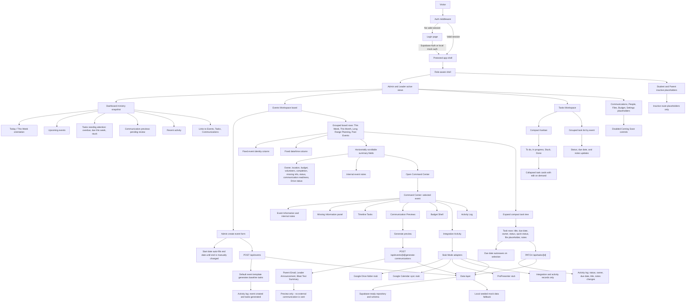

# Current Web App Functionality

Current as of June 23, 2026. (Originally drafted June 11, 2026; date corrected during 2026-06-23 doc scrub.)

> **Camp module**: For Camp-specific feature inventory, access model, import field map, and regression checklist, see [`docs/camp/CAMP_BLUEPRINT.md`](camp/CAMP_BLUEPRINT.md).

This diagram reflects the active Next.js web app only. The archived Google Sheets and Apps Script build under `archive/google-sheets-v1/` is historical context and is not active application code.

## Active Boundaries

- Active source folders: `app/`, `components/`, `lib/`, `supabase/`, `tests/`, `scripts/`, and `docs/`.
- Integrations remain Stub Mode only.
- Communications are previews only and are not sent.
- Student and Parent routes remain inactive placeholders.
- Notes are internal staff notes stored on events and tasks.
- Core records (profiles, events, tasks, activity logs) are scoped to a ministry via `ministry_id`. The app runs as a single default **Emerge** ministry today; Row Level Security restricts access to the authenticated user's ministry. See `docs/emma/architecture.md` (Implementation Note: Ministry Scope).
