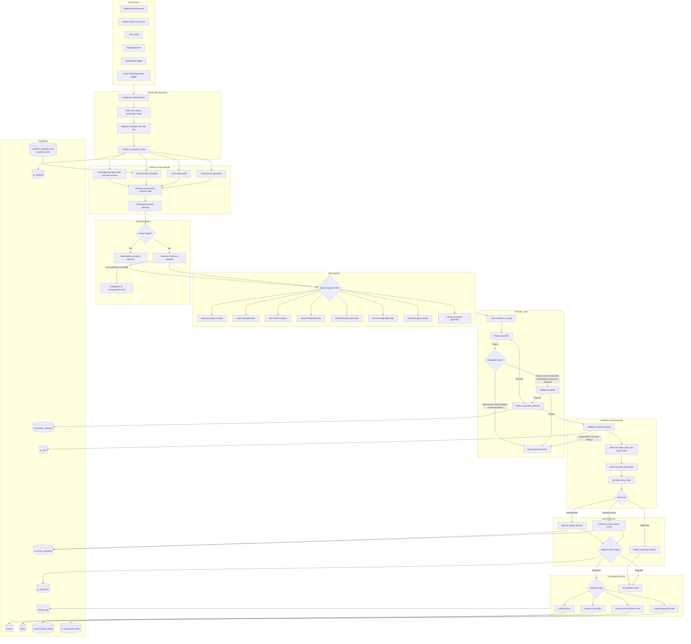
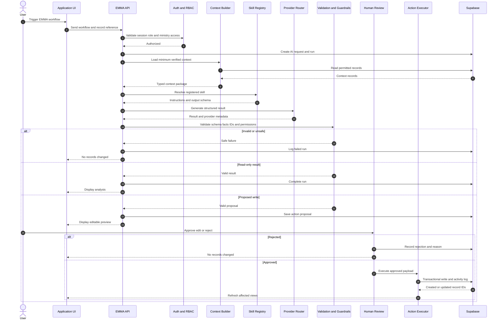

# EMMA AI Architecture

## Purpose

EMMA (Emerge Ministry Momentum Assistant) is the controlled AI orchestration layer for Lead Emergence. It supports event planning, task generation, communication drafting, operational analysis, and future student follow-up workflows without giving an AI model unrestricted authority over ministry records.

EMMA follows one governing rule:

> AI may interpret, recommend, summarize, and draft. Application code validates and executes. Humans approve sensitive or external actions.

## Phase 1 Scope

Phase 1 includes:

- typed EMMA requests and responses
- provider-neutral AI execution
- structured workflow routing
- event task proposals
- human approval before task creation
- parent email, leader GroupMe, and SMS draft generation
- communication review queue
- operational alerts and ministry briefs
- complete request, provider, proposal, approval, and activity logging

Phase 1 does not include:

- automatic external sending
- Planning Center OAuth or attendance sync
- student disengagement workflows
- autonomous database edits
- sermon-library RAG
- unrestricted chatbot tools

## Core Design Principles

1. **Deterministic before generative.** Buttons and system triggers select known workflows directly. AI classification is used only for ambiguous free-text requests.
2. **Structured output only.** Every provider response must pass a Zod schema before the application can use it.
3. **No direct model writes.** Models return proposals. Server-side application code performs validated writes.
4. **Human review for judgment-heavy actions.** Record changes and all external-facing communication require confirmation or approval.
5. **Verified context only.** EMMA may use records the authenticated user is authorized to access and only the fields required for the workflow.
6. **Ministry isolation.** Every request, context lookup, proposal, approval, and result is scoped by `ministry_id`.
7. **Sensitive-data minimization.** Medical information, confidential pastoral notes, private student-care data, secrets, and unrelated contact information must not enter model prompts or logs.
8. **Auditable operations.** Every AI-assisted action must be attributable to a user, run, provider attempt, proposal, and approval decision.
9. **Graceful failure.** Provider failures must not corrupt records or expose raw provider errors.
10. **Stub-safe development.** Local development and automated tests must remain deterministic without live provider credentials.

## High-Level Architecture



## Request Lifecycle



## Domains and Workflows

```ts
export type EmmaDomain =
  | "EVENTS"
  | "TASKS"
  | "COMMUNICATIONS"
  | "VOLUNTEERS"
  | "PEOPLE"
  | "FILES"
  | "REPORTING"
  | "RESEARCH"
  | "SYSTEM";

export type EmmaWorkflow =
  | "EVENT_PLAN"
  | "GENERATE_EVENT_TASKS"
  | "ANALYZE_TASK_HEALTH"
  | "DRAFT_PARENT_EMAIL"
  | "DRAFT_LEADER_GROUPME"
  | "DRAFT_SMS"
  | "ANALYZE_VOLUNTEER_GAPS"
  | "GENERATE_MINISTRY_SUMMARY"
  | "DRAFT_STUDENT_FOLLOW_UP"
  | "QUERY_MINISTRY_LIBRARY";
```

The last two workflows remain disabled until Planning Center and RAG phases.

## Risk and Approval Matrix

| Operation | Risk | Default behavior |
|---|---|---|
| Explain an event or summarize tasks | Read only | Execute immediately |
| Analyze overdue or blocked tasks | Read only | Execute immediately |
| Suggest event tasks | Internal write proposal | Show preview |
| Create tasks | Internal write | Require confirmation |
| Change event dates owner budget or status | Internal write | Require confirmation |
| Draft parent email | External facing | Save to review queue |
| Draft GroupMe or SMS | External facing | Save to review queue |
| Send external communication | External execution | Disabled in Phase 1 |
| Analyze student disengagement | Sensitive | Deferred |
| Draft student follow-up | Sensitive external | Deferred and mandatory review |
| Update or delete student source data | Restricted | Never delegated to AI |

## Data Model

### `ai_feature_configs`

Controls provider and model selection without hardcoding model names in workflow code.

Required fields:

- `id`
- `ministry_id`
- `feature_key`
- `enabled`
- `primary_provider`
- `primary_model`
- `fallback_provider`
- `fallback_model`
- `temperature`
- `max_output_tokens`
- `timeout_ms`
- `requires_approval`
- timestamps

### `ai_requests`

One record per user or system request.

Required fields:

- `id`
- `ministry_id`
- `requested_by`
- `source`
- `source_record_type`
- `source_record_id`
- `workflow`
- `status`
- `correlation_id`
- timestamps

Raw prompts containing sensitive data should not be retained by default.

### `ai_runs`

One logical execution of a registered skill.

Required fields:

- `id`
- `request_id`
- `skill_key`
- input and output schema versions
- `context_manifest`
- `status`
- `summary`
- `assumptions`
- `warnings`
- timing fields

`context_manifest` stores record references and context categories, not confidential content snapshots.

### `ai_provider_attempts`

One row per provider attempt.

Required fields:

- `id`
- `run_id`
- `provider`
- `model`
- `attempt_number`
- `status`
- `http_status`
- `error_code`
- `duration_ms`
- token usage when available
- estimated cost only when reliable
- timestamp

### `ai_action_proposals`

Stores a model-generated action before execution.

Required fields:

- `id`
- `run_id`
- `action_type`
- `risk_level`
- target table and record reference
- validated payload
- human-readable summary
- `requires_approval`
- `status`
- `expires_at`
- timestamp

### `ai_approvals`

Stores human decisions and approved edits.

Required fields:

- `id`
- `proposal_id`
- `decision`
- `decided_by`
- `decision_notes`
- original payload
- approved payload
- `decided_at`

### `voice_profiles`

Stores concise approved communication rules, not entire private message archives.

Required fields:

- `id`
- `ministry_id`
- `name`
- optional sender user reference
- `platform`
- `audience`
- `style_rules`
- approved example references
- `active`
- timestamps

### `communication_drafts`

Required status values:

- `draft`
- `pending_review`
- `changes_requested`
- `approved`
- `rejected`
- `sent`
- `failed`

Draft records should retain the related event, task, intended sender, audience, voice profile, EMMA run, and revision history.

### `ai_operational_alerts`

Stores deterministic operational conditions and optional AI summaries.

Required fields:

- `id`
- `ministry_id`
- `alert_type`
- `severity`
- optional event task or assignee references
- title
- deterministic details
- optional AI summary
- recommended action
- `status`
- first and last detected timestamps
- resolved timestamp
- source run reference

## Provider Error Policy

Fallback is allowed for:

- timeout
- rate limit
- provider unavailable
- retryable server failure
- payment required when another configured provider is available

Fallback is not allowed to hide:

- bad application request
- invalid credentials
- forbidden operation
- authorization failure
- application schema defect

Invalid structured output receives no more than one controlled repair attempt before the run fails safely.

## Security Requirements

- Credentials remain server-side environment variables.
- Service-role Supabase access is never exposed to the browser.
- Every table uses RLS and ministry scoping.
- Record ownership is rechecked at proposal approval time.
- Browser-provided ministry IDs and target IDs are never trusted without server verification.
- AI logs must not contain secrets, medical information, confidential pastoral notes, or unrelated student and parent data.
- Automated tests use fake provider adapters and isolated test data.

## Phase 1 Launch Test

EMMA Phase 1 is operational only when:

1. A real event produces an editable task proposal.
2. A user approves it and tasks appear in the event and task views.
3. A real event produces a parent email draft using verified facts and an approved voice profile.
4. The draft enters review and can be approved without being sent.
5. The request, run, provider attempts, proposal, approval, created tasks, draft revisions, and activity log are traceable.
6. A simulated provider failure falls back or fails safely without corrupting records.
7. The primary coordinator uses the workflow for one full week without developer assistance.
