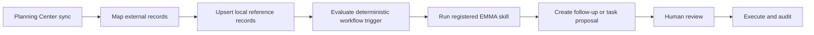

# EMMA Implementation Roadmap

## Build Strategy

EMMA should be introduced as a sequence of narrow, testable vertical slices. Do not build the router, communications, RAG, Planning Center, and provider waterfall at the same time.

The recommended order is:

1. contract and audit foundation
2. provider abstraction and health
3. skill registry and router
4. event task generation
5. approval and controlled execution
6. communication drafting and voice profiles
7. communication review queue
8. background operational intelligence
9. Planning Center-triggered workflows
10. ministry library and RAG

The first production milestone ends after Iteration 8. Planning Center and RAG begin only after EMMA has operated reliably with real ministry workflows.

## Iteration 1 — EMMA Contract and Audit Foundation

### Goal

Create the types, schemas, database records, RLS rules, and repository functions needed to track every EMMA request and proposal before any live model is called.

### Deliverables

- `lib/emma/types.ts`
- `lib/emma/schemas.ts`
- `lib/emma/errors.ts`
- `lib/emma/risk.ts`
- additive Supabase migration for AI request, run, provider-attempt, proposal, and approval records
- ministry-scoped RLS policies
- server-only repository functions
- architecture documentation
- deterministic tests

### Exit Criteria

- a mocked request can be created, run, completed, proposed, approved, and audited
- cross-ministry access is blocked
- no external AI calls exist
- existing application workflows remain unchanged

## Iteration 2 — Provider Abstraction and Health

### Goal

Introduce a provider-neutral execution layer that can use a configured primary and fallback model without leaking provider logic into features.

### Deliverables

- provider registry
- feature configuration loader
- normalized error classifier
- structured-output executor
- one controlled output-repair attempt
- provider attempt logging
- admin health summary
- fake provider adapters for tests

### Exit Criteria

- provider switching requires configuration rather than feature-code changes
- a simulated rate limit or timeout falls back successfully
- bad requests and authentication errors do not trigger inappropriate fallback
- no live provider is required for CI

### Implementation Note

Iteration 2 introduces the provider abstraction with Gemini as the first real
server-side provider and a deterministic mock provider as the default for tests.
All provider calls are audited through existing EMMA request/run/provider-attempt
records. No external ministry actions are executed in this iteration, and normal
build/test does not require `GEMINI_API_KEY`.

## Iteration 3 — Skill Registry and Router

### Goal

Create a registry of focused EMMA workflows and route requests safely.

### Deliverables

- skill-definition contract
- registry with unique workflow keys
- deterministic router for buttons and system triggers
- structured free-text classifier for ambiguous prompts
- clarification response for low-confidence requests
- authenticated `/api/ai/emma` route

### Exit Criteria

- explicit workflows bypass AI classification
- unknown or injected workflow names are rejected
- the router can select a skill but cannot mutate records

## Iteration 4 — Event Task Generator

### Goal

Deliver the first complete user-value workflow: generate an editable task proposal from a real event and an optional workflow template.

### Deliverables

- minimum event-context builder
- task-generation skill and output schema
- duplicate, due-date, owner, and sensitive-data validation
- Master Event Card generation action
- grouped template and AI-suggested preview
- saved `CREATE_TASKS` action proposal

### Exit Criteria

- a real event produces a useful task proposal
- no tasks are created before approval
- existing tasks are not duplicated
- the proposal remains editable

## Iteration 5 — Approval and Transactional Execution

### Goal

Allow an authorized user to approve, edit, reject, and safely execute a pending task proposal.

### Deliverables

- approve and reject API routes
- server-side revalidation
- all-or-nothing transactional task creation
- idempotency controls
- proposal expiration handling
- complete approval and activity logging
- event and task view refresh after success

### Exit Criteria

- an approved proposal creates tasks exactly once
- a rejected or expired proposal cannot execute
- changed event dates or invalid owners are caught before writing
- all created tasks retain EMMA and template provenance

## Iteration 6 — Voice Profiles and Communication Drafting

### Goal

Generate reviewable parent emails, leader GroupMe messages, and SMS drafts using verified event facts and approved voice rules.

### Deliverables

- `voice_profiles` data model or adaptation of an existing equivalent
- concise sender, platform, and audience style rules
- parent email skill
- leader GroupMe skill
- SMS skill
- fact provenance, assumptions, and missing-information fields
- communication draft persistence
- Master Event Card and Communications integration

### Exit Criteria

- real event details produce an editable communication draft
- missing facts are surfaced rather than invented
- confidential notes are excluded
- no sending API is called

## Iteration 7 — Communication Review Queue

### Goal

Provide an accountable review workflow for all AI-generated external-facing drafts.

### Deliverables

- pending-review queue
- filters by platform, audience, event, sender, and age
- edit, approve, request changes, reject, copy, and open-event actions
- append-only revision history
- exact approved-version retention
- role-based approval rules

### Exit Criteria

- every draft has a visible history
- every approval or rejection has an attributable user and timestamp
- unresolved missing information blocks approval
- no external sending occurs

## Iteration 8 — Background Operational Intelligence

### Goal

Add invisible operational value by detecting issues with deterministic rules and using AI only to summarize and prioritize verified facts.

### Initial Alerts

- upcoming event missing required planning fields
- event with no active tasks
- overdue task
- blocked task
- unassigned task
- workload concentrated on one person
- approaching event with low checklist completion
- approved communication not yet marked sent
- volunteer requirement not satisfied when supported by current schema

### Deliverables

- secure scheduled execution mechanism
- idempotent ministry-by-ministry processing
- `ai_operational_alerts` or equivalent existing structure
- EMMA Needs Attention dashboard panel
- manual Ministry Brief generation
- deterministic counts protected from model alteration

### Exit Criteria

- real issues appear without the user prompting EMMA
- alerts do not duplicate across runs
- resolved conditions close or resolve alerts
- AI summaries cannot change underlying counts

## Iteration 9 — Planning Center Trigger Integration

### Goal

Use Planning Center as the source of truth for student and attendance information and as a trigger source for controlled EMMA workflows.

### Planned Flow

### Guardrails

- EMMA does not independently overwrite Planning Center source records
- student follow-up requires restricted roles and human review
- attendance data is minimized before any model call
- no health, medical, or confidential care notes enter prompts

## Iteration 10 — Ministry Library and RAG

### Goal

Build a separately permissioned document research system for ministry files, sermon resources, policies, and approved reference material.

### Guardrails

- keep operational AI and RAG orchestration separate
- apply document-level permission and ministry filtering before retrieval
- cite retrieved sources in responses
- never treat a generated answer as an authoritative policy unless the cited source supports it
- do not expose private documents across ministries or roles

## Pull Request and Release Rules

Every iteration should:

1. begin from current `main`
2. use one focused feature branch
3. inspect current architecture before editing
4. create additive migrations only
5. preserve Stub Mode and deterministic tests
6. pass typecheck, lint, build, and relevant Playwright tests
7. open a pull request without merging or deploying
8. verify the Vercel preview before approval

## Phase 1 Operational Acceptance Test

The phase is complete only when all of the following succeed with real ministry data:

1. create or open an event
2. generate a proposed checklist
3. edit and approve it
4. verify tasks in the event and task views
5. generate a parent email draft from verified facts
6. confirm the correct voice profile
7. approve the draft without sending it
8. inspect complete request, run, provider, proposal, approval, revision, and activity history
9. simulate a provider failure and verify safe fallback or graceful failure
10. allow the primary coordinator to use the workflow for one full week without developer assistance
